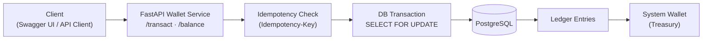

# Dino Wallet Service

A backend wallet service for managing **virtual, in-app credits** (Gold Coins, Diamonds, Loyalty Points) in a high-traffic system such as a gaming or loyalty platform.

Although the currency is virtual, the system treats it with the same rigor as real money:

* balances never go negative
* every credit movement is recorded permanently
* concurrent requests never corrupt state
* retries never double-apply transactions

🌐 **Live Deployment:** [https://dinoventures-production.up.railway.app](https://dinoventures-production.up.railway.app)

📖 **Interactive API Docs:** [https://dinoventures-production.up.railway.app/docs](https://dinoventures-production.up.railway.app/docs)

---

## Table of Contents

* [Problem Overview](#problem-overview)
* [High Level Architecture](#high-level-architecture)
* [Tech Choices & Rationale](#tech-choices--rationale)
* [How to Run the Service](#how-to-run-the-service)
* [API Overview](#api-overview)
* [Concurrency Strategy](#concurrency-strategy)
* [Idempotency](#idempotency)
* [Ledger-Based Architecture](#ledger-based-architecture)
* [Validation & Testing](#validation--testing)
* [Load Testing](#load-testing)
* [Limitations & Next Steps](#limitations--next-steps)

---

## Problem Overview

This is a **closed-loop wallet system**:

* credits exist only inside the application
* users cannot transfer credits between each other
* credits are not real money

Despite that, **data integrity is critical even under retries, failures, or concurrent requests**

The core challenges:

* **Concurrency:** preventing lost updates under simultaneous requests
* **Retries:** handling client retries safely
* **Auditability:** reconstructing balances from history if needed

---
## High-Level Architecture


---
## Tech Choices & Rationale

| Layer     | Choice             | Why                                       |
| --------- | ------------------ | ----------------------------------------- |
| Language  | Python 3.11        | Fast iteration, clear syntax|
| Framework | FastAPI            | Automatic OpenAPI docs, strong request validation |
| ORM       | SQLModel           | Single model for validation + database schema |
| Database  | PostgreSQL 15      | ACID transactions, row-level locking, proven reliability |
| Dev DB    | SQLite             | Zero-config local development (not for concurrency testing) |
| Server    | Uvicorn + Gunicorn | Production-ready ASGI server              |
| Hosting   | Railway            | Simple cloud deployment with managed PostgreSQL |

The choice is **SQLModel**, which avoids schema differences by combining Pydantic models and SQLAlchemy into one definition.

---

## How to Run the Service

### Option 1: Docker (Recommended)

This starts PostgreSQL, runs the seed script, and launches the API.

```bash
git clone https://github.com/AdityaMedidala/dinoventures
cd dino_wallet
docker compose up --build
```

Open: [http://localhost:8000/docs](http://localhost:8000/docs)

---

### Option 2: Local Python (SQLite)

```bash
python3 -m venv .venv
source .venv/bin/activate
pip install -r requirements.txt
python seed.py
uvicorn main:app --reload
```

> ⚠️ SQLite ignores row-level locks. Docker + PostgreSQL is hence preferred and used to test concurrency behavior.

---

## API Overview

### `GET /health`

```json
{ "status": "ok" }
```

### `GET /balance/{user_id}?asset_code=GOLD_COIN`

Returns the current balance. Asset codes are case-insensitive.

### `POST /transact`

Main transaction endpoint. Requires an `Idempotency-Key` header.

```json
{
  "user_id": "user_123",
  "amount": 50,
  "transaction_type": "TOPUP",
  "asset_code": "GOLD_COIN"
}
```

Transaction types:

* `TOPUP` – user purchases credits
* `BONUS` – system grants free credits
* `SPEND` – user spends credits

Responses include `tx_id` and the updated balance.

---

## Concurrency Strategy

The primary risk in a wallet system is the **lost update problem**:
two requests read the same balance, both modify it, and one update disappears and to avoid this **pessimistic row-level locking** is used:

* Wallet rows are locked using `SELECT … FOR UPDATE`
* Locks are held for the duration of the database transaction
* Concurrent requests targeting the same wallet are serialized by PostgreSQL

To prevent deadlocks, wallet rows are **always locked in ascending ID order**.

This approach reduces throughput but guarantees correctness

---

## Idempotency

Network retries can cause the same request to be sent multiple times.

Every `POST /transact` requires an **Idempotency-Key** header:

* the request payload is hashed
* the key + hash + response are stored atomically
* retries with the same key return the cached response
* reuse of a key with a different payload returns `409 Conflict`

This guarantees **at-most-once execution**, even under retries.

---

## Ledger-Based Architecture

Instead of mutating balances directly, the system uses a **double-entry ledger**.

Each transaction writes:

* one ledger entry for the user wallet
* one equal and opposite entry for the system treasury

Balances are a cached view; the ledger is the source of truth.

This provides:

* full auditability
* reconstructable balances
* clear invariants (ledger entries always sum to zero)

---

## Validation & Testing

All core behaviors were validated against the **live Railway deployment** which includes:

* all transaction flows
* error handling
* idempotency replays
* transaction history ordering
* end-to-end balance correctness
* concurrent requests against the same wallet

📸 *Swagger UI — successful transaction with Idempotency-Key*  


📸 *Swagger UI — rejected request missing Idempotency-Key*


Manual verification was performed using **FastAPI’s `/docs` UI**.

---

## Load Testing

Also load-tested using **k6** against the live deployment.

### Test Profile

* Up to **50 concurrent virtual users**
* Mixed `TOPUP` and `SPEND` workload
* Single shared wallet to maximize contention
* PostgreSQL with row-level locking enabled

### Results Summary

| Metric            | Result           |
| ----------------- | ---------------- |
| Throughput        | ~47 requests/sec |
| Error rate        | **0%**           |
| p90 latency       | ~535 ms          |
| p95 latency       | ~605 ms          |
| p99 latency       | < 1 s            |
| Deadlocks         | None             |
| Balance integrity | Preserved        |

Occasional slower requests (~2s max) observed under peak contention, which is expected given intentional locking for correctness.

📄 **Load Test Report:**  
The interactive k6 load test report is available via GitHub Pages::[artifacts/load-test-report.html](https://adityamedidala.github.io/dinoventures/load-test-report.html)

---

## Limitations

* **No pagination on `/transactions`** – Paging for scale can be utilized
* **No migration system wired** – Alembic is included and would be enabled before schema changes
* **Treasury can go negative** – This is intentional accounting behavior keeping mind real world behavior from apps like stripe

---

<div align="center">
Built by Aditya Medidala
</div>
